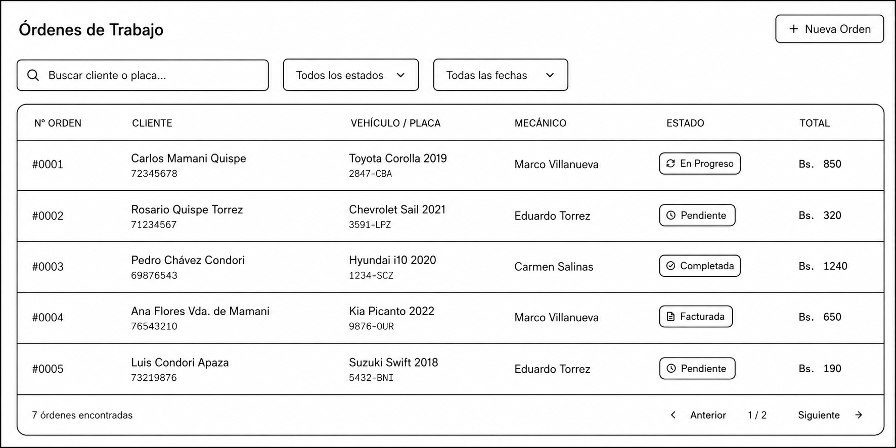
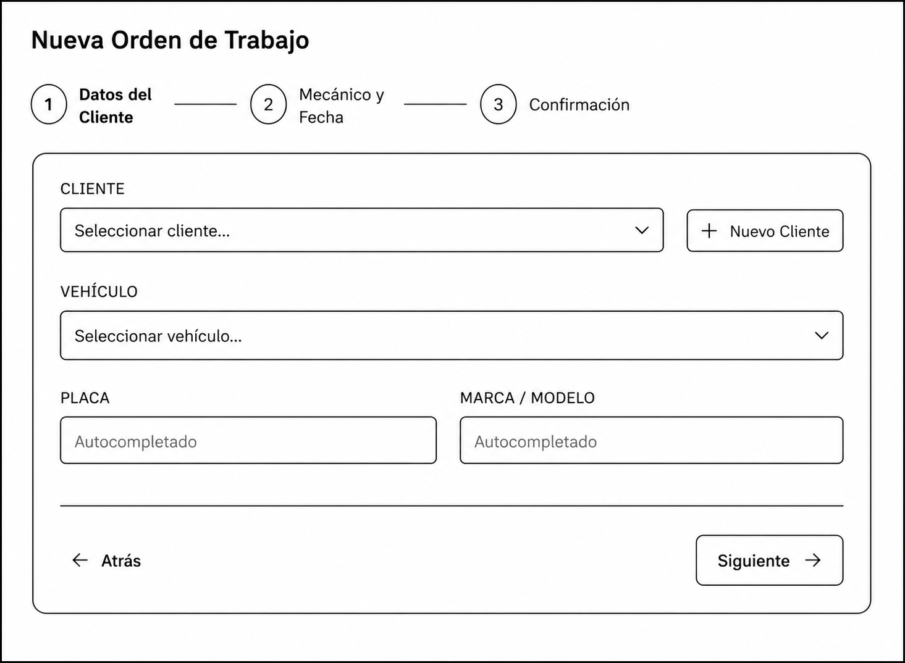
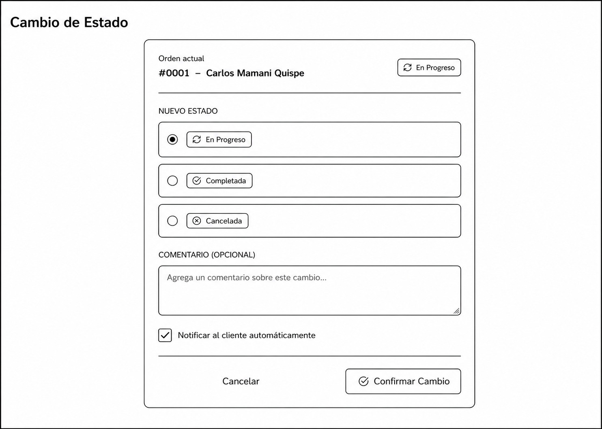
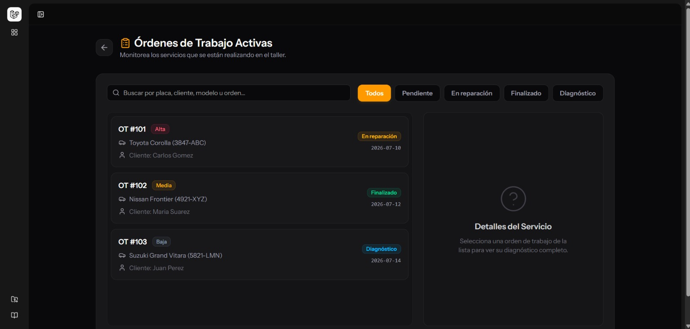
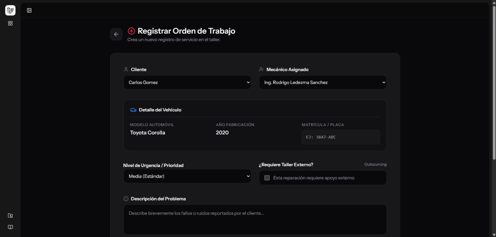

# 🔧 Taller Santa Cruz — Sistema de Gestión de Taller de Reparaciones

Sistema web desarrollado con Laravel 11 (PHP 8.2) y React (Inertia.js) para la administración integral de un taller de reparaciones: control de usuarios, gestión de clientes, vehículos, y generación de órdenes de trabajo y diagnóstico.

## 📋 Módulos del sistema

| Módulo | Pantallas |
|---|---|
| 🔐 Seguridad | Login, Recuperación de contraseña |
| ⚙️ Administración | Usuarios, Roles, Dashboard |
| 💼 Gestión Comercial | Clientes, Vehículos |
| 📊 Operaciones y Servicios | Órdenes de Trabajo Activas, Nueva Orden de Trabajo |

## 🛠️ Tecnologías

- Backend: Laravel 11 · PHP 8.2
- Base de datos: MySQL
- Frontend: React 18 · Inertia.js · Tailwind CSS · TypeScript
- Herramientas: Vite · Node.js · Composer · Git · Visual Studio Code

## ✏️ Wireframes (baja fidelidad)

Los wireframes definen la estructura y distribución inicial de las principales pantallas del sistema, enfocándose en la experiencia de usuario (UX) antes de aplicar el estilo visual final.

**1. Gestión de Servicios — Lista de Órdenes de Trabajo**  


**2. Gestión de Servicios — Formulario de Nueva Orden**  


**3. Gestión de Servicios — Cambio de Estado de Orden**  


## 🎨 Mockups (alta fidelidad)

Los mockups muestran el diseño visual final del sistema: paleta de colores, tipografía, componentes modernos e identidad de la marca.

Paleta (Dark Mode): Zinc Dark #09090b (fondo) · Ámbar #f59e0b (acento principal) · Rosa #f43f5e (acento secundario)

**1. Operaciones — Reporte de Reparaciones (Órdenes Activas)**  


**2. Operaciones — Reporte de Diagnósticos (Nueva Orden)**  


## 🚀 Instalación del proyecto

```bash
# Clonar el repositorio
git clone https://github.com/RonSalvet/Proyecto-Laravel.git
cd Proyecto-Laravel

# Instalar dependencias de PHP y Node
composer install
npm install

# Configurar entorno
copy .env.example .env
php artisan key:generate

# Base de datos
php artisan migrate

# Ejecutar servidores de desarrollo (en 2 terminales separadas)
php artisan serve
powershell -ExecutionPolicy Bypass -Command "npm run dev"
```

👤 Autor Rodrigo Ledezma Sanchez. — Proyecto académico de desarrollo web con Laravel y React.